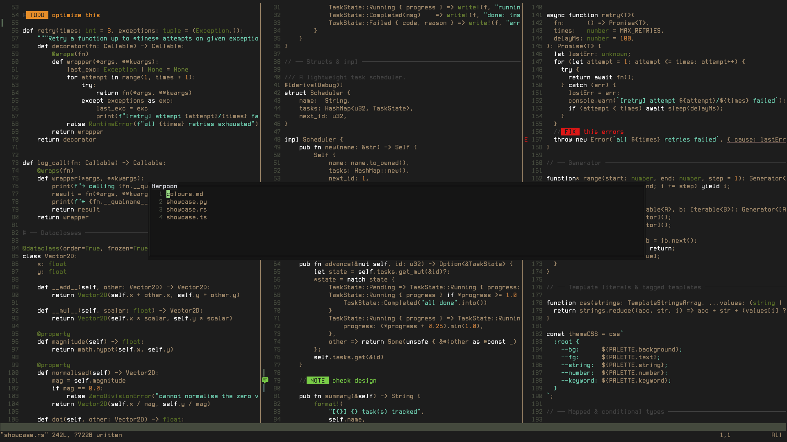

## Owly

A quiet, low noise, low colour count, dark Neovim colour scheme with natural colours that supports floating windows for plugins like Harpoon and Trouble.



### Installation

Just add this to you lazy setup.

```lua
"OwlfaceGames/owly.nvim"
```

Then add this to your init.lua to enable the colorscheme.

```lua
vim.cmd.colorscheme('owly')
```
