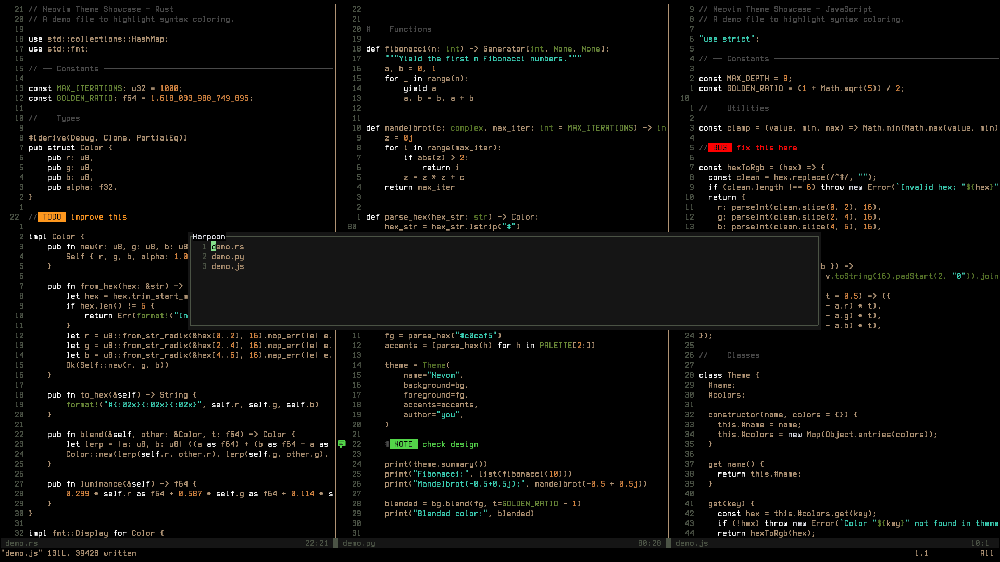

# Owly

A quiet, low noise, low colour count, dark Neovim colour scheme with natural colours that supports floating windows for plugins like Harpoon and Trouble.



### Lualine


### Matching Tmux & Kitty Theme

- For the matching tmux theme see [owly.tmux](https://github.com/OwlfaceGames/owly.tmux).
- For the matching Kitty theme see [owly.kitty](https://github.com/OwlfaceGames/owly.kitty)

## Installation

Just add this to you lazy setup.

```lua
"OwlfaceGames/owly.nvim"
```

Then add this to your init.lua to enable the colorscheme.

```lua
vim.cmd.colorscheme('owly')
```

## Support
If you like my work, consider supporting me through [GitHub Sponsors](https://github.com/sponsors/OwlfaceGames)🩷.
