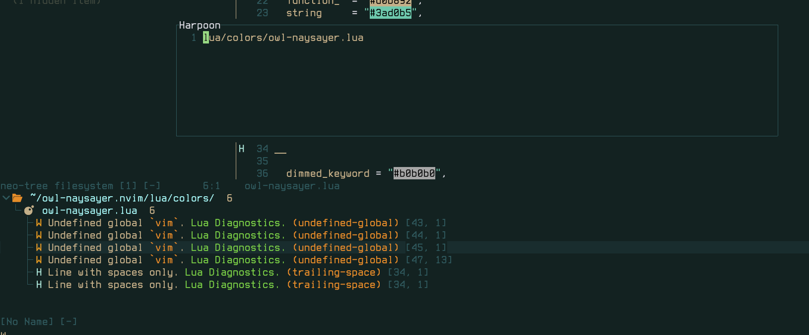
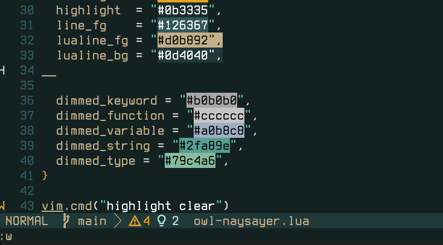

# owl-naysayer.nvim

A fork of a port of a copy of a famous programmers colorscheme (yes we're that many layers deep).

I love this colorscheme but it has some issues so I forked and fixed them so I can get on with my work.

Shoutout to RostislavArts for the Neovim port it's a great theme just needed some tweaks to suit my needs. Check it out [here](https://github.com/RostislavArts/naysayer.nvim).

## whats fixed?
- Floating windows for plugins like harpoon and trouble.
- The colour of lualine has been fixed as warnings were too hard to see.



No colours were changed or added that weren't already in the colorscheme. I just swapped out the lualine colours to a more sane option so it's actually readable.



Jon would never be using something that would show a warning because that's for noobs that write bad code. For real though he doesn't use an lsp or anything from what I gather so considering 90% of people using this colorscheme will be, why wouldn't you change it?

Below is the original readme I just changed the Installation section to point to my theme in case anyone else wants to use it. But honestly I just did this for me.

# naysayer (original readme).nvim

A dark green-blue Neovim colorscheme. It's a port of [Nick Aversano's Emacs theme](https://github.com/nickav/naysayer-theme.el) for Neovim, best known from Jonathan Blow's compiler livestreams.

## Showcase
### Treesitter **disabled** (most accurate to Jon's theme)


### Treesitter **enabled**


## Installation

### Using Packer

```lua
use { 'OwlfaceGames/owl-naysayer.nvim' }
```

### Using Lazy.nvim

```lua
{
  'OwlfaceGames/owl-naysayer.nvim',
  priority = 1000,
  lazy = false,
  config = function()
    vim.cmd.colorscheme('owl-naysayer')
  end,
}
````

## Usage

Inside `init.lua`
```lua
vim.cmd.colorscheme('owl-naysayer')
```

## License

[GPL-3+](LICENSE) — same license as the original Emacs theme.

